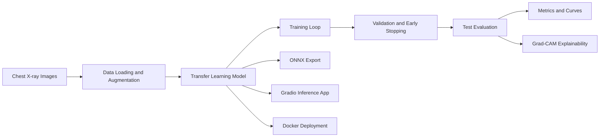
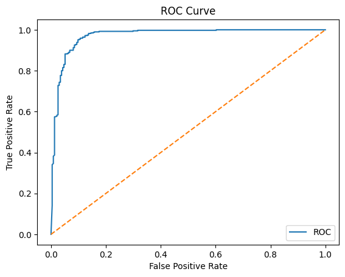
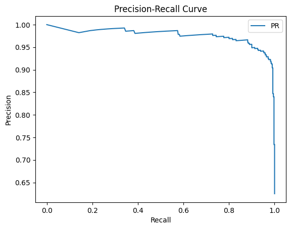
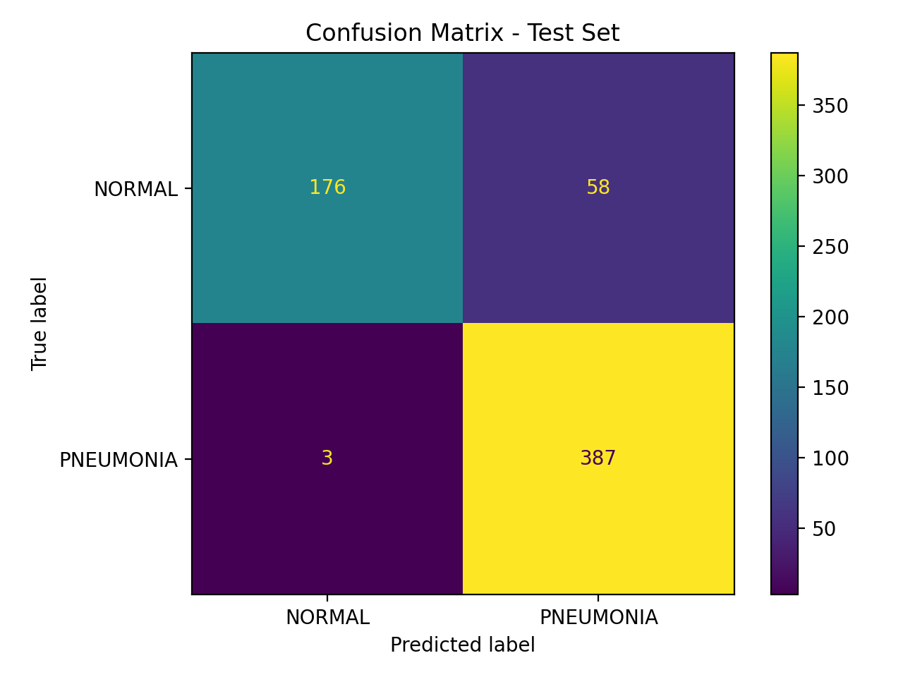
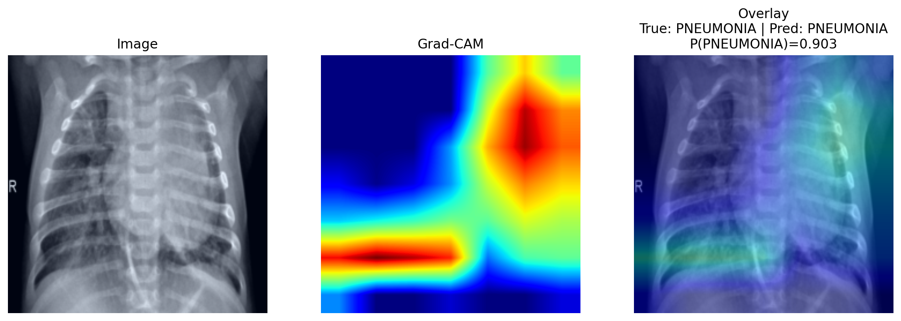
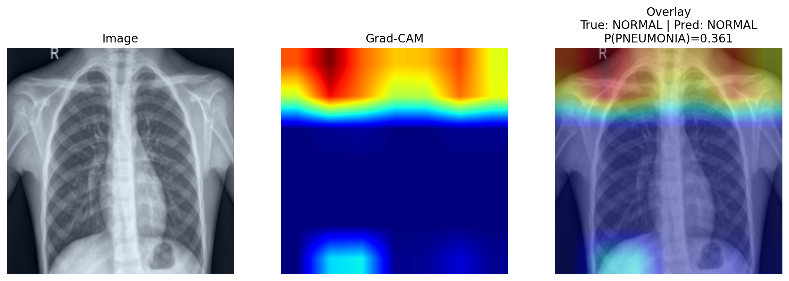
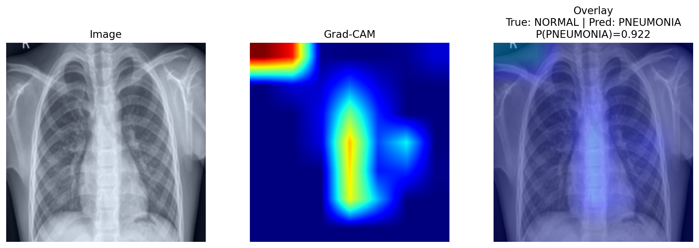
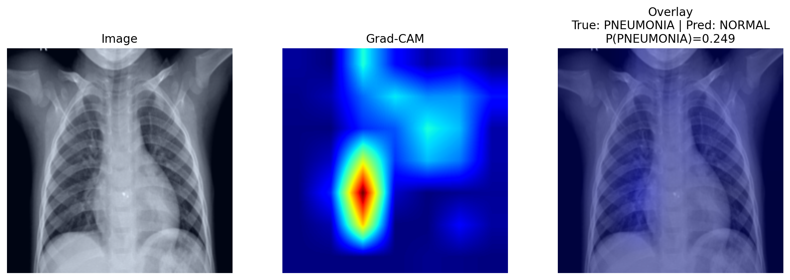

# MedicalImageClassifier


A reproducible, explainable, and deployment-ready medical image classification pipeline for chest X-ray pneumonia detection.

This project demonstrates an end-to-end deep learning workflow for medical image classification, including data loading, transfer learning, imbalance-aware training, evaluation with medical-ML-relevant metrics, Grad-CAM explainability, model export, Docker support, testing, and responsible model documentation.

> **Disclaimer:** This project is for educational and research purposes only. It is not intended for clinical diagnosis, clinical decision-making, or deployment in real medical settings.

---

## Project Goal

The goal of this repository is to classify chest X-ray images into two classes:

* `NORMAL`
* `PNEUMONIA`

The project is designed as a professional portfolio example showing that I can work with image data, build a complete PyTorch training pipeline, evaluate model performance properly, generate visual explanations, and package the project in a reproducible way.

---

## What This Project Demonstrates

This repository demonstrates practical skills in:

* Medical image classification
* PyTorch model training
* Transfer learning with ResNet/timm backbones
* Dataset loading and augmentation
* Class imbalance handling
* Robust training with early stopping and learning-rate scheduling
* Evaluation using Accuracy, ROC-AUC, PR-AUC, Brier score, and confusion matrix
* Grad-CAM explainability for image model interpretation
* ONNX export and deployment preparation
* Docker-based reproducibility
* Unit testing and CI-ready project structure
* Responsible AI documentation with a model card

---

## Pipeline Overview



---

## Repository Structure

```text
MedicalImageClassifier/
├── configs/
│   ├── default.yaml
│   └── smoke_cpu.yaml
├── src/
│   ├── __init__.py
│   ├── app.py
│   ├── data.py
│   ├── explain.py
│   ├── export.py
│   ├── generate_gradcam_examples.py
│   ├── gradcam.py
│   ├── infer.py
│   ├── losses.py
│   ├── metrics.py
│   ├── model.py
│   ├── train.py
│   ├── tta.py
│   ├── tune.py
│   └── visualize.py
├── outputs/
│   ├── figures/
│   │   ├── roc_test.png
│   │   ├── pr_test.png
│   │   ├── confusion_matrix.png
│   │   ├── gradcam_true_positive.png
│   │   ├── gradcam_true_negative.png
│   │   ├── gradcam_false_positive.png
│   │   └── gradcam_false_negative.png
│   └── metrics/
│       └── test_metrics.json
├── tests/
├── Dockerfile
├── Makefile
├── MODEL_CARD.md
├── requirements.txt
└── README.md
```

---

## Dataset

This project expects the chest X-ray dataset to be organized as follows:

```text
data/
└── chest_xray/
    ├── train/
    │   ├── NORMAL/
    │   └── PNEUMONIA/
    ├── val/
    │   ├── NORMAL/
    │   └── PNEUMONIA/
    └── test/
        ├── NORMAL/
        └── PNEUMONIA/
```

The dataset is not included in this repository. Users should download the chest X-ray pneumonia dataset separately and place it under:

```text
data/chest_xray/
```

The dataset folder is ignored by Git to avoid uploading large files and to respect dataset licensing.

---

## Installation

Create and activate a virtual environment:

```bash
python3 -m venv .venv
source .venv/bin/activate
```

Install dependencies:

```bash
python -m pip install --upgrade pip
python -m pip install -r requirements.txt
```

Run tests:

```bash
pytest
```

---

## Configuration Files

This project uses YAML configuration files.

### CPU smoke-test configuration

Use this on a local machine without a GPU:

```bash
python -m src.train --config configs/smoke_cpu.yaml
```

The smoke configuration is intentionally small. It is used to verify that the full pipeline runs locally.

### Full training configuration

Use this for a stronger experiment on a GPU machine:

```bash
python -m src.train --config configs/default.yaml
```

The default configuration is intended for more complete training, for example on Google Colab, Kaggle, a university GPU, or a cloud GPU instance.

---

## Training

Run training with:

```bash
python -m src.train --config configs/smoke_cpu.yaml
```

The training pipeline includes:

* loading train/validation/test image splits
* applying image transforms
* building a transfer-learning model
* class-imbalance-aware loss
* early stopping
* checkpoint saving
* test-set evaluation
* ROC and PR curve generation
* metrics export to JSON
* confusion matrix generation

The best model checkpoint is saved to:

```text
outputs/checkpoints/best.pt
```

Model checkpoints are ignored by Git because they can be large.

---

## Evaluation Metrics

The model is evaluated using several metrics:

| Metric           | Why it is included                               |
| ---------------- | ------------------------------------------------ |
| Accuracy         | Measures overall classification correctness      |
| ROC-AUC          | Measures ranking performance across thresholds   |
| PR-AUC           | Important for imbalanced classification problems |
| Brier Score      | Measures probability calibration quality         |
| Confusion Matrix | Shows false positives and false negatives        |

---

## Current Results

The following results are from a local CPU smoke-test run using `ResNet18`.
They demonstrate that the full training and evaluation pipeline works.

| Model              | Accuracy | ROC-AUC | PR-AUC | Brier Score |
| ------------------ | -------: | ------: | -----: | ----------: |
| ResNet18 smoke run |    0.840 |   0.941 |  0.962 |       0.124 |

Confusion matrix from the smoke-test run:

```text
[[145,  89],
 [ 11, 379]]
```

These results should not be interpreted as final clinical performance. A full benchmark should be run with a stronger configuration, repeated seeds, and a GPU-trained model.

---

## Evaluation Figures

### ROC Curve



### Precision-Recall Curve



### Confusion Matrix



---

## Explainability with Grad-CAM

This project includes Grad-CAM visualizations to inspect which image regions influence the model prediction.

The goal is not to claim clinical reasoning, but to support model debugging and error analysis.

### True Positive

Pneumonia image correctly predicted as pneumonia.



### True Negative

Normal image correctly predicted as normal.



### False Positive

Normal image predicted as pneumonia.



### False Negative

Pneumonia image missed by the model.



---

## Generate Grad-CAM Examples

After training, generate Grad-CAM examples with:

```bash
python -m src.generate_gradcam_examples --config configs/smoke_cpu.yaml
```

This script searches the test set for:

* true positive
* true negative
* false positive
* false negative

and saves the visualizations under:

```text
outputs/figures/
```

---

## Inference App

The repository includes a Gradio app for local inference.

Example command:

```bash
python -m src.app --ckpt outputs/checkpoints/best.pt
```

The app takes a chest X-ray image as input and returns the predicted probability for each class.

---

## Command-Line Inference

A command-line inference script is included for testing the trained model on a single image without using the Gradio interface.

This is useful for quick local testing, debugging, or environments where launching a web app is not necessary.

Example:

```bash
python -m src.predict_image \
  --image path/to/image.jpeg \
  --ckpt outputs/checkpoints/best.pt \
  --arch resnet18
```

Example using a test image:

```bash
python -m src.predict_image \
  --image data/chest_xray/test/PNEUMONIA/person1_bacteria_1.jpeg \
  --ckpt outputs/checkpoints/best.pt \
  --arch resnet18
```

The script returns:

```text
Prediction: PNEUMONIA
NORMAL probability: 0.1234
PNEUMONIA probability: 0.8766
```

The checkpoint file is not committed to GitHub because trained model files can be large. To use command-line inference, first train the model locally or place a compatible checkpoint at:

```text
outputs/checkpoints/best.pt
```
---

## ONNX Export

The trained model can be exported to ONNX for deployment-oriented workflows.

Example:

```bash
python -m src.export --ckpt outputs/checkpoints/best.pt
```

ONNX export makes the model easier to use outside a pure PyTorch environment.

---

## Docker

A `Dockerfile` is included for future containerized inference.

Docker is useful for packaging the project so that the application can run in a clean, reproducible environment without manually setting up Python dependencies on the host machine. In this repository, Docker is intended mainly for **inference/demo usage**, not for full model training.

At the moment, the main verified workflows are the local Python workflows:

```bash
python -m src.train --config configs/smoke_cpu.yaml
python -m src.generate_gradcam_examples --config configs/smoke_cpu.yaml
python -m src.export --ckpt outputs/checkpoints/best.pt --arch resnet18
python -m src.app --ckpt outputs/checkpoints/best.pt --arch resnet18
pytest
```

Docker testing is planned for a machine with enough available disk space. The Docker image should be tested later using:

```bash
docker build -t medical-image-classifier .
```

and, if using a local checkpoint:

```bash
docker run -p 7860:7860 \
  -v "$(pwd)/outputs/checkpoints:/app/outputs/checkpoints" \
  medical-image-classifier
```

The trained checkpoint is not committed to GitHub because model files can be large. Instead, the checkpoint should be mounted into the container from the local machine when running Docker.

Current Docker status:

* Dockerfile included
* Docker build not yet verified locally due to limited disk space
* Main training, evaluation, Grad-CAM, ONNX export, Gradio app, tests, and CI are verified without Docker

---

## Testing

Run tests with:

```bash
pytest
```

The repository includes tests to verify core functionality such as imports, model components, metrics, or pipeline utilities.

---

## Optional: Multi-Agent ML Audit Workflow

This project can be extended with a lightweight multi-agent workflow for automated ML quality control.

The agents would not make medical decisions. Instead, they would support engineering and audit tasks.

Possible agents:

| Agent                | Responsibility                                                          |
| -------------------- | ----------------------------------------------------------------------- |
| Data QA Agent        | Check class balance, corrupted files, image sizes, and possible leakage |
| Training Agent       | Launch training from a selected config                                  |
| Evaluation Agent     | Compute metrics, curves, threshold analysis, and calibration            |
| Explainability Agent | Generate Grad-CAM and Integrated Gradients examples                     |
| Model Card Agent     | Update documentation with results, limitations, and intended-use notes  |
| Deployment Agent     | Verify ONNX export, Docker build, and inference app                     |

This would demonstrate practical AI orchestration for ML engineering while keeping the project focused on responsible medical-image analysis.

---

## Limitations

This project has important limitations:

* It is not clinically validated.
* It is trained on a public dataset that may not represent all patient populations, scanner types, hospitals, or imaging protocols.
* Dataset labels may contain noise.
* The model may learn shortcuts or artifacts rather than medically meaningful features.
* Performance may degrade under domain shift.
* Grad-CAM visualizations are useful for debugging but do not prove clinical reasoning.
* The current reported results come from a smoke-test run and should not be treated as a final benchmark.

---

## Responsible Use

This repository is intended for learning, experimentation, and portfolio demonstration. It should not be used for diagnosis, triage, treatment decisions, or any real clinical workflow.

Any real medical AI system would require:

* larger and more diverse datasets
* external validation
* clinical expert review
* uncertainty analysis
* fairness and bias assessment
* regulatory review
* prospective evaluation before deployment

---

## Future Improvements

Planned improvements include:

* full GPU training with ResNet50 or EfficientNet
* repeated experiments with multiple random seeds
* threshold optimization for sensitivity/specificity trade-offs
* calibration plots and temperature scaling
* stronger error analysis
* Integrated Gradients visualizations
* model comparison across multiple backbones
* lightweight multi-agent audit workflow
* improved CI smoke tests
* optional experiment tracking with MLflow or Weights & Biases

---

## Skills Demonstrated

This project demonstrates the ability to build and document a complete medical-image classification workflow, including:

* image dataset handling
* deep learning model training
* transfer learning
* evaluation under class imbalance
* explainable AI for image models
* error analysis
* reproducibility
* deployment preparation
* software testing
* responsible AI documentation
